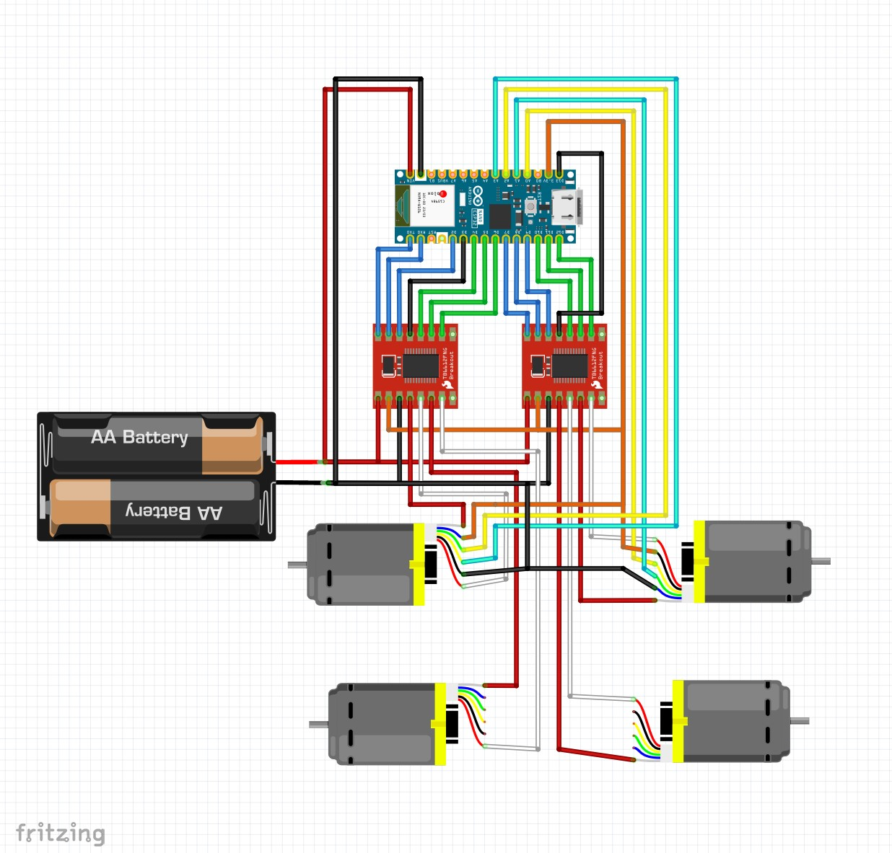

# Functional Prototype Control Code

## Overview

This sketch runs the functional prototype motor controller on an Arduino Nano ESP32 board. It exposes a BLE interface for starting and stopping motor motion, streaming motor position updates, and collecting BLE timing metrics during test runs.

The current implementation uses:

- A FreeRTOS task per motor pair for asynchronous motion control.
- Quadrature encoder interrupts for closed-loop position tracking.
- BLE command callbacks that queue incoming commands for processing in `loop()`.

## What This Code Does

- Initializes the motor driver pins, encoder pins, and BLE stack at startup.
- Accepts BLE commands to start and stop motor motion.
- Reports left and right motor positions over BLE while connected.
- Collects timing and throughput metrics during BLE test mode.

## Hardware Requirements

- ESP32-compatible board with BLE support.
- Two DC motors with quadrature encoders.
- Dual H-bridge motor driver wiring compatible with the configured PWM and direction pins.
- A BLE-capable host device for sending commands and reading notifications.

## Assumptions

The code currently assumes:

- Device name: `NanoESP32-Willow-BLE`
- BLE service UUID: `55f8a5ee-886f-4929-a3ab-5745cbbceab5`
- Command characteristic UUID: `30bce33a-6e60-4306-ad36-8718f82ee801`
- Data characteristic UUID: `fef211ef-bc20-4f2f-9e9d-3cb6c7b6f772`
- Metrics characteristic UUID: `555ff5a9-d76d-4945-b7a2-f26612fc5be5`
- ACK characteristic UUID: `a2a1c8b3-4d7e-4f2a-9b1c-8e7d5f3a2b1c`
- Motor position 1 characteristic UUID: `d8cfb4a5-7d1b-4d40-8f7f-f6a7f4f0c4e1`
- Motor position 2 characteristic UUID: `4f5cc7fd-1f5c-4aab-82fb-0d6f3dbe7b2b`
- Motor encoder resolution: `1727 * 2` counts per revolution
- Motor RPM constant: `95` for RobotShop motors, or `60` for the Amazon motors noted in the sketch comments
- Position notifications are sent every 50 ms, or sooner if the reported count changes

If any of these change, update both the sketch and this README.

## Circuit Diagram

## Wiring Reference (OF BUILT PROTOTYPE!!! As of 4/14, wiring below does not match circuit diagram above - ik its dumb, I'll fix soon - Josiah)

### Motor Pair 1

| Signal | Pin |
| ---- | -- |
| PWMA | D6 |
| AIN2 | D5 |
| AIN1 | D4 |
| STBY | D3 |
| BIN1 | D2 |
| BIN2 | D0 |
| PWMB | D1 |

### Motor Pair 2

| Signal | Pin |
| ---- | --- |
| PWMA | D12 |
| AIN2 | D11 |
| AIN1 | D10 |
| STBY | D13 |
| BIN1 | D9  |
| BIN2 | D8  |
| PWMB | D7  |

### Encoder Inputs

| Signal | Pin |
| ------ | --- |
| ENCA_1 | D17 |
| ENCB_1 | D18 |
| ENCA_2 | D19 |
| ENCB_2 | D20 |

## Build and Upload

1. Open `FunctionalPrototype.ino` in the Arduino IDE (or optionally, visual studio code with the arduino extension).
2. Select the correct board (Arduino Nano ESP32) and serial port (should auto-select or show only one available port, choose that one).
3. Install any required ESP32 Arduino core support if it is not already present.
4. Connect your laptop or PC to the arduino with a usb-c connector (the Arduino IDE should detect the connection/COM port)
5. Upload the sketch to the board.
6. Disconnect the usb-c after uploading the code
7. The code will now automatically run when the Arduino is powered on

## Runtime Behavior

At startup, `setup()` configures the motor controllers, attaches encoder interrupts, and starts BLE advertising.

The main `loop()` function:

- Calls the BLE update routine.
- Drains queued BLE commands.
- Starts or stops motion on both motor pairs.
- Sends motor position notifications while connected.
- Publishes BLE test metrics when test mode is active.

Motion requests are asynchronous. `start()` queues work for the motor task instead of directly blocking until the move is complete.

## BLE Interface

The BLE layer is defined in `BLE.h` and `Packets.h`. Commands arrive as `CommandPacket` values and are handled by the main loop.

### Shared BLE UUIDs

The website and this sketch use the same BLE service and characteristic UUIDs.

| Type | Name | UUID |
| --- | --- | --- |
| Service | Main BLE service | `55f8a5ee-886f-4929-a3ab-5745cbbceab5` |
| Characteristic | Command input | `30bce33a-6e60-4306-ad36-8718f82ee801` |
| Characteristic | Data echo | `fef211ef-bc20-4f2f-9e9d-3cb6c7b6f772` |
| Characteristic | Metrics | `555ff5a9-d76d-4945-b7a2-f26612fc5be5` |
| Characteristic | ACK | `a2a1c8b3-4d7e-4f2a-9b1c-8e7d5f3a2b1c` |
| Characteristic | Motor position 1 | `d8cfb4a5-7d1b-4d40-8f7f-f6a7f4f0c4e1` |
| Characteristic | Motor position 2 | `4f5cc7fd-1f5c-4aab-82fb-0d6f3dbe7b2b` |

### Supported Commands

| Command ID | Name | Purpose |
| --- | --- | --- |
| `0b00` | `STOP_MOTOR` | Stop both motor pairs |
| `0b01` | `START_MOTOR` | Start a motion request for both motor pairs |
| `0b10` | `STOP_BT` | End BLE test mode and stop metrics collection |
| `0b11` | `START_BT` | Begin BLE test mode and reset metrics counters |

### Command Packet Fields

`CommandPacket` contains the following fields:

- `commandId`
- `inSteps`
- `reverse`
- `degrees`
- `speed`
- `interval`

### Notifications

The device can send the following BLE notifications:

- `BLE_notifyMotorPosition1(int32_t positionCounts)`
- `BLE_notifyMotorPosition2(int32_t positionCounts)`
- `BLE_notifyMetrics(const MetricsPacket& metrics)`
- `BLE_notifyAck(const AckPacket& ack)`
- `BLE_notifyDataEcho(const DataPacket& packet)`

### Metrics Packet

`MetricsPacket` reports:

- Timestamp when the snapshot was generated
- Total notifications sent since `START_BT`
- Total bytes sent since `START_BT`
- Mean notification interval
- RMS jitter of the interval
- Overrun count
- Uptime since `START_BT`

## Motor Control Model

Each `MotorPair` instance owns its own FreeRTOS task and command queue.

Key behavior:

- `begin()` initializes hardware and starts the task.
- `start(degrees, speedPercent, reverse)` queues a motion request.
- `stop()` stops the motor hardware and clears pending work.
- `getSignedPositionCounts()` returns encoder position with direction applied.

The implementation also includes stall detection and adaptive control logic inside the motor task.

## Troubleshooting

- If the board does not advertise, verify the ESP32 core and BLE stack are installed correctly.
- If motion is reversed, check the `reverse` flag passed in the BLE command; DON'T change the motor wiring.
- If encoder counts look wrong, confirm the interrupt pins and encoder phase wiring match the table above.
- If motion timing is inconsistent, review the motor RPM constant, counts-per-revolution value, and any BLE traffic that may be affecting task scheduling.

## Maintenance Notes

- Update `Packets.h` first if the BLE protocol changes.
- Update `BLE.h` and the BLE implementation together if notification behavior changes.
- Update the pin tables here whenever the sketch pinout changes.
- Recheck the encoder counts-per-revolution constant after swapping motors or encoders.
- Keep this README aligned with the sketch comments so the documentation reflects the current runtime behavior.

## Related Files

- [FunctionalPrototype.ino](FunctionalPrototype.ino)
- [BLE.h](BLE.h)
- [Packets.h](Packets.h)
- [MotorPair.h](MotorPair.h)
- [BLE.cpp](BLE.cpp)
- [MotorPair.cpp](MotorPair.cpp)
